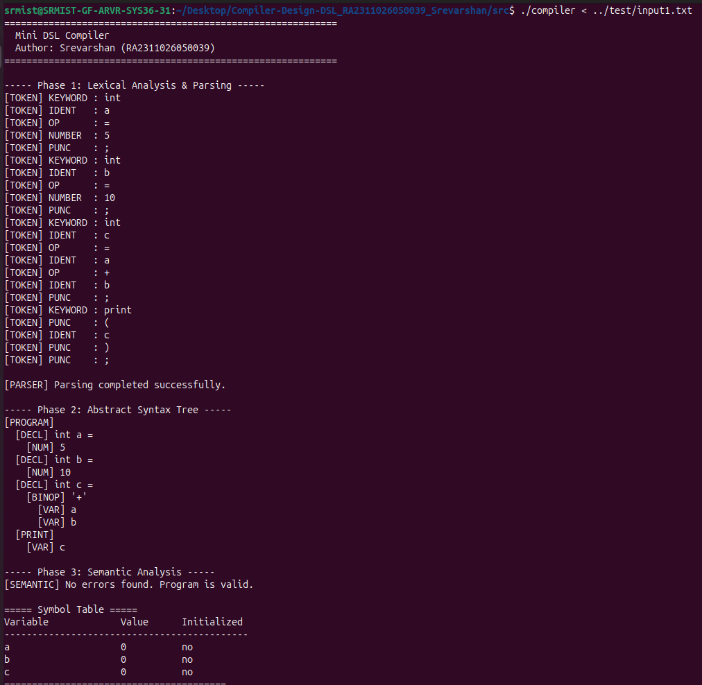
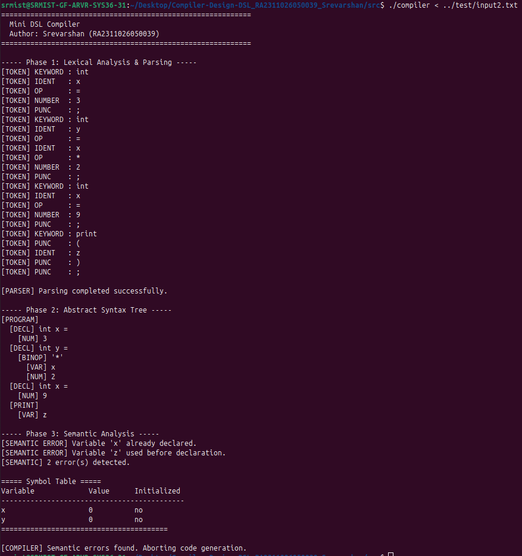
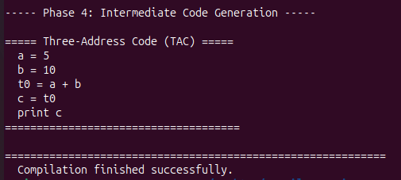

# Compiler-Design-DSL_RA2311026050039_Srevarshan

> A **mini compiler** for a custom Domain-Specific Language (DSL) built with
> **Flex** (lexer), **Bison** (parser), and **C** (AST, semantic analysis,
> and three-address intermediate code generation).

---

## 📋 Project Description

This project implements a complete **compiler front-end** for a simple DSL
that supports:

- Integer variable declarations (`int a = 5;`)
- Arithmetic expressions (`+`, `-`, `*`, `/`)
- Print statements (`print(expr);`)

The compiler runs all four phases and reports results for each:

| Phase | Tool | Output |
|-------|------|--------|
| Lexical Analysis | Flex | Token stream |
| Parsing | Bison | AST |
| Semantic Analysis | C | Symbol table + error report |
| Code Generation | C | Three-Address Code (TAC) |

---

## 🗂️ Folder Structure

```
Compiler-Design-DSL_RA2311026050039_Srevarshan/
│
├── src/
│   ├── lexer.l          ← Flex lexer
│   ├── parser.y         ← Bison grammar + AST construction
│   ├── ast.c / ast.h    ← AST node definitions and utilities
│   ├── semantic.c / .h  ← Symbol table + semantic checker
│   ├── icg.c / icg.h    ← Three-Address Code generator
│   └── main.c           ← Compiler driver
│
├── test/
│   ├── input1.txt       ← Valid DSL program
│   └── input2.txt       ← Program with semantic errors
│
├── output/
│   └── output1.txt      ← Expected output for input1
│
├── docs/
│   └── report.md        ← Full academic report
│
└── README.md            ← This file
```

---

## 🛠️ Tools Required

| Tool | Install (Ubuntu/Debian) | Windows |
|------|------------------------|---------|
| Flex | `sudo apt install flex` | [WinFlexBison](https://github.com/lexxmark/winflexbison) |
| Bison | `sudo apt install bison` | Included in WinFlexBison |
| GCC | `sudo apt install gcc` | [MinGW-w64](https://www.mingw-w64.org/) or WSL |

---

## ▶️ Steps to Build and Run

### 1. Navigate to the `src/` directory

```bash
cd src
```

### 2. Generate the lexer

```bash
flex lexer.l
# Produces: lex.yy.c
```

### 3. Generate the parser

```bash
bison -d parser.y
# Produces: parser.tab.c  parser.tab.h
```

### 4. Compile everything with GCC

```bash
gcc lex.yy.c parser.tab.c ast.c semantic.c icg.c main.c -o compiler
```

### 5. Run on the valid test case

```bash
./compiler < ../test/input1.txt
```

### 6. Run on the error test case

```bash
./compiler < ../test/input2.txt
```

> **Windows note:** If using WinFlexBison, replace `flex` with `win_flex`
> and `bison` with `win_bison`.  
> The binary will be `compiler.exe`; run as `compiler < ..\test\input1.txt`.

---

## 📥 Sample Input / Output

### `test/input1.txt`

```
int a = 5;
int b = 10;
int c = a + b;
print(c);
```

### Expected output (abbreviated)

```
----- Phase 1: Lexical Analysis & Parsing -----
[TOKEN] KEYWORD : int
[TOKEN] IDENT   : a
[TOKEN] OP      : =
[TOKEN] NUMBER  : 5
[TOKEN] PUNC    : ;
...

[PARSER] Parsing completed successfully.

----- Phase 2: Abstract Syntax Tree -----
[PROGRAM]
  [DECL] int a =
    [NUM] 5
  [DECL] int b =
    [NUM] 10
  [DECL] int c =
    [BINOP] '+'
      [VAR] a
      [VAR] b
  [PRINT]
    [VAR] c

----- Phase 3: Semantic Analysis -----
[SEMANTIC] No errors found. Program is valid.

===== Symbol Table =====
Variable             Value      Initialized
--------------------------------------------
a                    0          no
b                    0          no
c                    0          no
========================================

----- Phase 4: Intermediate Code Generation -----

===== Three-Address Code (TAC) =====
  a = 5
  b = 10
  t0 = a + b
  c = t0
  print c
=====================================

============================================================
  Compilation finished successfully.
============================================================
```

### `test/input2.txt` (semantic errors)

```
int x = 3;
int y = x * 2;
int x = 9;       ← duplicate declaration
print(z);        ← z undeclared
```

Expected errors:
```
[SEMANTIC ERROR] Variable 'x' already declared.
[SEMANTIC ERROR] Variable 'z' used before declaration.
[SEMANTIC] 2 error(s) detected.
[COMPILER] Semantic errors found. Aborting code generation.
```

---

## 📸 Screenshots

### 1. Valid Input Compilation (input1.txt)


### 2. Semantic Error Handling (input2.txt)


### 3. Intermediate Code Generation (TAC)


---

## 👤 Author Details

| Field | Value |
|-------|-------|
| **Name** | Srevarshan |
| **Register No** | RA2311026050039 |
| **Course** | Compiler Design |
| **Date** | April 2026 |

---

## 📄 License

This project is submitted for academic purposes.
